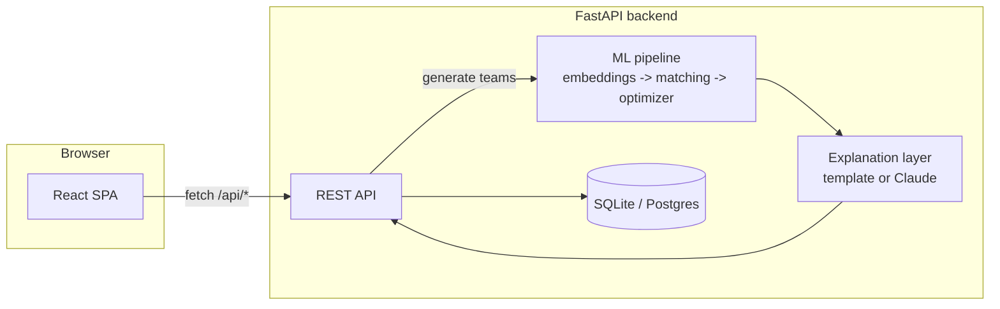

# AI Hackathon Team Maker

[](.github/workflows/ci.yml)
[](backend)
[](frontend)
[](LICENSE)

An AI/ML-powered platform that automatically forms balanced, high-performing
hackathon teams from participant skills, experience, interests, and working
style — then explains every team it builds in plain language.

## Contents

- [What's implemented](#whats-actually-implemented)
- [Architecture](#architecture)
- [Stack](#stack)
- [Quickstart](#quickstart)
- [Running with Docker](#running-with-docker-recommended-for-a-real-demo)
- [Configuration](#configuration)
- [Project structure](#project-structure)
- [API reference](#api-reference)
- [Testing & CI](#testing--ci)
- [Database migrations](#database-migrations)

## What's actually implemented

- **Registration** — participants submit skills, domains, role, experience,
  availability, working style, and a short bio.
- **NLP embeddings** (`backend/app/ml/embeddings.py`) — TF‑IDF + cosine
  similarity turns each profile into a vector and measures interest overlap
  between any two participants. (Swap in Sentence-Transformers any time you
  have open internet access — see the comment at the top of that file for
  the one-class change needed.)
- **Skill-complementarity algorithm** (`backend/app/ml/matching.py`) — maps
  raw skills onto core categories (frontend / backend / ML / design / cloud
  / PM) and scores how well two people fill each other's gaps.
- **Team optimizer** (`backend/app/ml/optimizer.py`) — greedy seeding
  followed by thousands of local-search swap evaluations (a lightweight
  simulated-annealing hill climb) to maximize skill coverage,
  complementarity, shared interest, experience balance, and role diversity.
- **AI explanation layer** (`backend/app/ml/explainer.py`) — generates a
  plain-language explanation, strengths, weaknesses, and a suggested
  project idea for every team, grounded entirely in the computed scores.
  Runs with **zero API key required** (template mode). If you set
  `ANTHROPIC_API_KEY`, it automatically switches to real Claude-generated
  explanations using the same underlying data.
- **Find My Teammates** — ranks the best potential teammates for any one
  person with a compatibility score and a reason.
- **Organizer tooling** — CSV export/import of the roster, generated-team
  export, roster search/filter (by name, skill, domain, role,
  unassigned-only), and a real **admin login system** (accounts, roles,
  audit log, dashboard) that gates destructive/regenerating actions.
- **Admin dashboard** — a dedicated `/admin` page for logged-in organizers:
  roster/team analytics (skill, role, domain, experience distributions),
  a recent-activity audit trail, bulk CSV import, a one-click team reset,
  and superadmin-only management of other admin accounts.
- **Production hardening** — structured request logging, consistent JSON
  error responses, database migrations (Alembic), Docker images for both
  services, a CI pipeline, and a real test suite (47 backend + 11 frontend
  tests, ~94% backend coverage on core logic).

## Architecture



Request flow for team generation: the frontend calls
`POST /api/teams/generate` → the router loads all participants → the
optimizer (`ml/optimizer.py`) seeds and refines groupings using scores from
`ml/matching.py` and `ml/embeddings.py` → each finished team is handed to
`ml/explainer.py` for a grounded, data-driven write-up → results are
persisted and returned.

## Stack

| Layer      | Technology |
|------------|------------|
| Frontend   | React + Vite + Tailwind CSS, Vitest + Testing Library |
| Backend    | Python + FastAPI, Pydantic v2, structured logging |
| Database   | SQLite by default; one env var away from PostgreSQL (`DATABASE_URL`) |
| Migrations | Alembic |
| ML / NLP   | scikit-learn (TF-IDF, cosine similarity) |
| AI layer   | Template engine by default; optional Claude API |
| Testing    | pytest + pytest-cov (backend), Vitest (frontend) |
| CI/CD      | GitHub Actions (lint, test, build, Docker image build) |
| Deployment | Docker + Docker Compose (nginx-served frontend, uvicorn backend) |

> **Why SQLite instead of PostgreSQL, and TF-IDF instead of Sentence-Transformers?**
> Both choices make the project runnable immediately with zero external
> setup — no database server to install, no model weights to download.
> Both are one-line/one-class swaps documented in the code, so moving to
> the "full" stack is straightforward once you're deploying somewhere with
> more infrastructure.

## Quickstart

### 1. Backend

```bash
cd backend
python -m venv venv
source venv/bin/activate        # Windows: venv\Scripts\activate
pip install -r requirements.txt
alembic upgrade head            # create the schema
python seed_data.py             # optional: adds 16 sample participants
uvicorn app.main:app --reload --port 8000
```

Backend runs at `http://localhost:8000`. Interactive API docs (Swagger UI)
at `http://localhost:8000/docs`.

### 2. Frontend

```bash
cd frontend
npm install
npm run dev
```

Frontend runs at `http://localhost:5173` and proxies `/api` calls to the
backend automatically (see `vite.config.js`).

### 3. Try it

1. Open `http://localhost:5173`
2. Register a few participants (or just run `python seed_data.py` for 16
   ready-made ones)
3. Go to **Roster** to see everyone — try the search box and the
   "unassigned only" filter
4. Go to **Teams** → pick a team size → **Generate teams** → **Export CSV**
5. Go to **Find My Teammates** → pick yourself → see ranked matches

> On first backend startup, a default admin account is created automatically
> (username `admin`; check the server logs for a generated password, unless
> you set `ADMIN_BOOTSTRAP_PASSWORD`). Click **Admin login** in the top-right
> nav, sign in, and a **Dashboard** link appears with roster analytics, an
> audit log, CSV import, a team-reset button, and admin-account management.

A `make` shortcut exists for most of the above — see `make help`.

## Running with Docker (recommended for a real demo)

One command builds and runs both services, with the backend automatically
applying database migrations on startup:

```bash
docker compose up --build
```

- Frontend (served by nginx): `http://localhost:8080`
- Backend API directly: `http://localhost:8000`

Copy `.env.example` to `.env` first if you want to set
`ADMIN_BOOTSTRAP_USERNAME` / `ADMIN_BOOTSTRAP_PASSWORD` / `JWT_SECRET`,
`ANTHROPIC_API_KEY`, or `CORS_ORIGINS` — every value is optional and has a
safe default, though you should set `JWT_SECRET` explicitly in production
(otherwise admin sessions are invalidated on every restart).

## Configuration

All configuration is centralized in `backend/app/config.py` and sourced
from environment variables (see `backend/.env.example` for the full list
with descriptions):

| Variable | Default | Purpose |
|----------|---------|---------|
| `DATABASE_URL` | `sqlite:///./hackteam.db` | Swap to a Postgres URL for production |
| `ADMIN_BOOTSTRAP_USERNAME` | `admin` | Username for the auto-created first admin account |
| `ADMIN_BOOTSTRAP_PASSWORD` | *(empty = random, logged once)* | Password for that first admin account |
| `JWT_SECRET` | *(random per process)* | Signs admin session tokens — set a stable value in production |
| `JWT_EXPIRES_MINUTES` | `720` (12h) | How long an admin login session lasts |
| `CORS_ORIGINS` | `*` | Comma-separated allowed origins |
| `ANTHROPIC_API_KEY` | *(empty = template mode)* | Enables real Claude-generated team explanations |
| `LOG_LEVEL` | `INFO` | Standard Python logging level |


## Project structure

```
ai-hackathon-team-maker/
├── backend/
│   ├── app/
│   │   ├── main.py                # FastAPI app, middleware, error handlers
│   │   ├── config.py              # Centralized settings (env-driven)
│   │   ├── security.py            # Admin API-key auth dependency
│   │   ├── logging_config.py      # Structured logging setup
│   │   ├── models.py              # SQLAlchemy models
│   │   ├── schemas.py             # Pydantic request/response schemas
│   │   ├── database.py            # DB engine/session config
│   │   ├── utils.py               # DB <-> API conversion helpers
│   │   ├── ml/
│   │   │   ├── embeddings.py      # NLP / TF-IDF embedding layer
│   │   │   ├── matching.py        # Skill-complementarity scoring
│   │   │   ├── optimizer.py       # Team formation optimizer
│   │   │   └── explainer.py       # AI/LLM explanation layer
│   │   └── routers/
│   │       ├── participants.py    # CRUD, search/filter, CSV export
│   │       ├── teams.py           # Generate/list teams, CSV export
│   │       └── find_teammates.py
│   ├── tests/                     # pytest suite (unit + API integration)
│   ├── migrations/                # Alembic migration scripts
│   ├── seed_data.py                # Sample roster for demos
│   ├── Dockerfile
│   └── requirements.txt
├── frontend/
│   ├── src/
│   │   ├── pages/                 # Register, Roster, Teams, FindTeammates, NotFound
│   │   ├── components/            # NavBar, ScoreMeter, Tag, ErrorBoundary, AdminLoginControl
│   │   ├── context/                # ToastContext, AuthContext
│   │   ├── api/client.js          # Fetch wrapper for the backend API
│   │   ├── tests/                 # Vitest suite
│   │   ├── App.jsx
│   │   └── main.jsx
│   ├── Dockerfile
│   ├── nginx.conf
│   ├── index.html
│   ├── tailwind.config.js
│   └── package.json
├── .github/workflows/ci.yml       # Lint, test, build, Docker build
├── docker-compose.yml
├── Makefile
└── README.md
```

## API reference

| Method | Path | Auth | Purpose |
|--------|------|------|---------|
| POST | `/api/participants` | — | Register a participant |
| GET  | `/api/participants` | — | List participants (supports `search`, `skill`, `domain`, `role`, `unassigned_only`, `limit`, `offset`) |
| GET  | `/api/participants/export.csv` | — | Download the full roster as CSV |
| GET  | `/api/participants/{id}` | — | Get one participant |
| PATCH | `/api/participants/{id}` | admin | Edit a roster entry |
| DELETE | `/api/participants/{id}` | admin | Remove a participant |
| POST | `/api/teams/generate` | admin | Run the optimizer, returns generated teams |
| GET  | `/api/teams` | — | List currently generated teams |
| GET  | `/api/teams/export.csv` | — | Download teams + members as CSV |
| GET  | `/api/teams/{id}` | — | Get one team |
| PATCH | `/api/teams/{id}/rename` | admin | Rename a team |
| GET  | `/api/find-teammates/{participant_id}` | — | Ranked teammate suggestions for one person |
| POST | `/api/auth/login` | — | Log in, returns a JWT session token |
| GET  | `/api/auth/me` | admin | Current logged-in admin's profile |
| POST | `/api/auth/change-password` | admin | Change your own password |
| GET/POST | `/api/auth/admins` | superadmin | List / create admin accounts |
| PATCH/DELETE | `/api/auth/admins/{id}` | superadmin | Update role/status or remove an admin account |
| GET  | `/api/admin/stats` | admin | Dashboard analytics (distributions, averages, recent activity) |
| GET  | `/api/admin/audit-log` | admin | Full audit trail of admin actions |
| POST | `/api/admin/teams/reset` | admin | Clear all teams without regenerating |
| POST | `/api/admin/participants/import-csv` | admin | Bulk-register participants from a CSV upload |
| GET  | `/api/health` | — | Liveness/readiness probe |

"admin" routes require `Authorization: Bearer <token>` from `/api/auth/login`;
"superadmin" routes additionally require that account's role to be
`superadmin`. See **Admin login & dashboard** below.

## Admin login & dashboard

Destructive or organizer-only actions (removing a participant, generating
or resetting teams, bulk CSV import, managing other admin accounts) require
a real login instead of a shared secret key.

- **First run**: a superadmin account is created automatically. Its
  username is `ADMIN_BOOTSTRAP_USERNAME` (default `admin`); its password
  is `ADMIN_BOOTSTRAP_PASSWORD` if you set one, otherwise a random
  password is generated and printed once in the backend logs.
- **Logging in**: click **Admin login** in the top-right of the nav bar,
  or `POST /api/auth/login`. A session token is stored for the browser
  tab and sent as `Authorization: Bearer <token>` on subsequent requests.
- **Dashboard** (`/admin` once logged in): registration/team analytics
  (skill, role, domain and experience distributions, average scores), a
  CSV bulk-import tool, a one-click "reset all teams" action, and a
  recent-activity audit log of every admin action.
- **Managing other admins**: superadmins can create additional admin (or
  superadmin) accounts, deactivate or reactivate one, change a role, or
  delete an account, all from the dashboard's "Organizer accounts" panel.
  Every admin can change their own password from the dashboard.
- **Sessions**: JWTs signed with `JWT_SECRET`, valid for `JWT_EXPIRES_MINUTES`
  (12 hours by default). Set `JWT_SECRET` explicitly in production so
  sessions survive a backend restart.

Full interactive docs (with request/response schemas) are always available
at `/docs` while the backend is running.

## Testing & CI

```bash
# Backend: 47 tests covering ML logic + both routers, ~94% coverage
cd backend && pytest --cov=app --cov-report=term-missing

# Frontend: component + API-client tests
cd frontend && npm test
```

`.github/workflows/ci.yml` runs on every push/PR: backend lint (ruff) +
tests + a migration up/down smoke test, frontend lint (eslint) + tests +
production build, and finally builds both Docker images to catch
Dockerfile regressions before merge.

## Database migrations

Schema changes are managed with Alembic instead of relying on
`create_all()` in production:

```bash
cd backend
alembic upgrade head                          # apply all pending migrations
alembic revision --autogenerate -m "message"  # after changing models.py
```

The Docker image applies migrations automatically on container start (see
`backend/entrypoint.sh`), so `docker compose up` is always a complete,
schema-current deploy.

## Notes on the "free plan" build

Everything above works with no paid API key and no external network calls
at runtime — the ML and explanation layers are fully self-contained. The
Claude-API hook in `explainer.py` is there for when you want richer
natural-language explanations later; it degrades gracefully to the
template engine if no key is set or the call fails.
